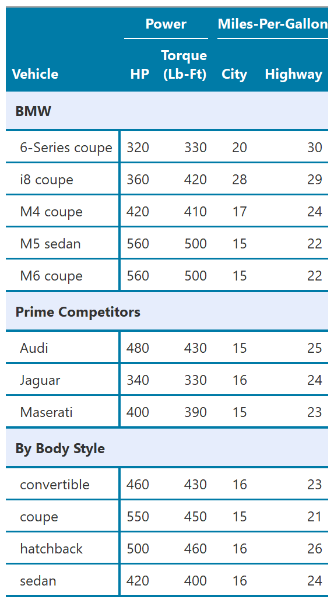

<!-- README.md is generated from README.Rmd. Please edit that file -->

# gt-tips

<!-- badges: start -->
<!-- badges: end -->

The goal of gt-tips is to demo of some tips for `gt` table production

Features I need in a table: - customized calculations (e.g., break out
into my own calcs) - readable column and row labels - formatting values
to e.g., dollars, percent, comma - borders, shading, bold - column
spanners - row spanners

Output formats: - Nice preview look - Something git-trackable (e.g., csv
or md output) - Document production output (e.g., to word docs or
indesign)

``` r
source("gtcars-ex.R")
#> -- Attaching packages --------------------------------------- tidyverse 1.3.1 --
#> v ggplot2 3.3.5     v purrr   0.3.4
#> v tibble  3.1.4     v dplyr   1.0.7
#> v tidyr   1.1.3     v stringr 1.4.0
#> v readr   2.0.1     v forcats 0.5.1
#> -- Conflicts ------------------------------------------ tidyverse_conflicts() --
#> x dplyr::filter() masks stats::filter()
#> x dplyr::lag()    masks stats::lag()
source("tab_style.R")
head(comparison_data)
#> # A tibble: 6 x 9
#>   grp               row_label      mfr   model bdy_style    hp   trq mpg_c mpg_h
#>   <chr>             <chr>          <chr> <chr> <chr>     <dbl> <dbl> <dbl> <dbl>
#> 1 BMW               6-Series coupe BMW   6-Se~ coupe       315  330   20    30  
#> 2 BMW               i8 coupe       BMW   i8    coupe       357  420   28    29  
#> 3 BMW               M4 coupe       BMW   M4    coupe       425  406   17    24  
#> 4 BMW               M5 sedan       BMW   M5    sedan       560  500   15    22  
#> 5 BMW               M6 coupe       BMW   M6    coupe       560  500   15    22  
#> 6 Prime Competitors Audi           Audi  <NA>  <NA>        482  425.  15.2  24.8
```

Here is the gt table:

``` r
gttbl <- comparison_data %>%
  gt(
    rowname_col = "row_label",
    groupname_col = "grp"
  ) %>%
  cols_hide(c(mfr, model, bdy_style)) %>%
  
  # labels
  tab_stubhead("Vehicle") %>%
  tab_spanner(label = "Power", columns = c(hp, trq)) %>%
  tab_spanner(label = "Miles-per-gallon", columns = c(mpg_c, mpg_h)) %>%
  cols_label(!!! col_disp_labels) %>%
  cols_label(trq = html("Torque<br>(lb-ft)")) %>%
  
  # cell formatting
  fmt_number(columns = where(is.numeric), n_sigfig = 2) %>%
  #fmt_markdown(columns = c(grp)) %>% # currently not possible to format stub as markdown: https://github.com/rstudio/gt/issues/694
  tab_style_blue()

gtsave(gttbl, "figs/gtcars-ex.png")
```

<!-- -->
